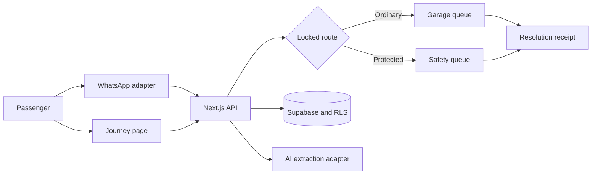

# IrinAbo

> Shared journey reports. Protected routing. Accountable follow-up.

IrinAbo is a proof of concept for passengers and transport operators. A passenger can report a concern from a familiar channel, add optional location context, and choose a protected route when transport staff may be involved. Operators receive source-labelled evidence and a record of who accepted the next action.

The project addresses two OSF × Andela challenge tracks:

- **Safety, Reporting & Protection** through protected reporting and clear escalation paths.
- **Stability & Social Cohesion** through source-preserving updates that reduce rumours and conflicting accounts.

All people, operators, journeys and incidents in the demonstration are fictional.

## Live demonstration

- Product: <https://irinabo.vercel.app>
- Passenger report: <https://irinabo.vercel.app/report>
- Seeded journey: <https://irinabo.vercel.app/journey/TW204>
- Read-only sample case: <https://irinabo.vercel.app/judge/case>
- Capability evidence: <https://irinabo.vercel.app/judge>
- Resolution receipt: <https://irinabo.vercel.app/receipt/demo-receipt>

## What works

| Capability | Status | Evidence |
| --- | --- | --- |
| Public passenger report flow | Live demo | Posts to `/api/reports` and returns a source-linked, deterministic routing result |
| Protected routing | Live | Fixed rules and denial tests keep protected cases away from ordinary roles |
| Journey page | Live | Seeded journey `TW204`, passenger session creation and optional web location updates |
| Staff workspace | Live with configured Supabase | Authentication, organisation scope, journey creation and incident actions |
| Judge Mode | Live | Public, read-only capability labels, metrics and fictional case evidence |
| WhatsApp webhook | Adapter ready | Signature validation, trip session, report intake and AI extraction code are present |
| WhatsApp delivery and IrinAbo Call | Simulated | No production sender, consenting recipients or external responders are configured |
| Public-agency dispatch | Deferred | IrinAbo does not contact police, hospitals or emergency agencies |

The public browser simulator does not store reports in the shared database. It demonstrates server intake and routing without adding judge-generated safety reports to the common dataset.

## Two-minute review route

1. Open `/report` and continue with the seeded concern.
2. Choose **Yes, staff are involved** and send the demo report.
3. Open `/judge/case` to compare the protected passenger account with the driver account. Neither source receives a truth score.
4. Open `/journey/TW204` to see optional web location sharing and the WhatsApp Sandbox handoff.
5. Open `/receipt/demo-receipt` and request a review.
6. Finish at `/judge` to separate live, simulated, fictional and deferred capabilities.

## Run locally

Requires Node.js 20+ and pnpm.

```bash
pnpm install
cp .env.example .env.local
pnpm dev
```

Open <http://localhost:3000>. The homepage, report simulator, read-only sample case and capability labels work without provider credentials. Hosted journey data, staff authentication, WhatsApp and AI providers require the corresponding environment variables.

```bash
pnpm test
pnpm lint
pnpm build
```

The verified submission baseline passes 12 unit tests, lint and a production build.

## Architecture



Application rules choose access, routing, deadlines and recipients. AI cannot change them. Original accounts remain visible, copied messages do not become independent sources, and location evidence includes source and freshness.

## Trust and privacy choices

- Incoming messages remain untrusted source material.
- Protected status controls visibility. It does not declare a report true.
- Original and conflicting accounts remain side by side.
- Reporter identity and precise location use separate permissions.
- Twilio webhooks require signature validation and provider message IDs are deduplicated.
- `Received`, `accepted`, `action underway` and `closed with outcome` remain separate states.
- The product states when a capability is simulated or deferred.

## AI use

AI software development tools helped scaffold the application, translate the specification into typed rules, build tests and review failures. Runtime AI is limited to transcription, translation, extraction and source-linked summaries. A deterministic fallback preserves the reporting flow when no model provider is configured.

See [`docs/AI_BUILD_LOG.md`](docs/AI_BUILD_LOG.md), [`docs/AI_DECISIONS.md`](docs/AI_DECISIONS.md) and [`docs/AI_FAILURES.md`](docs/AI_FAILURES.md).

## Limits

- Browser location stops when the page closes and may stop when the device suspends the page.
- Device coordinates may be inaccurate or spoofed.
- WhatsApp and voice delivery remain simulated until credentials and consenting test recipients are configured.
- The project does not guarantee rescue or replace local emergency channels.
- Nigeria is the first configuration pack, not a claim of legal or operational uniformity across Africa.

Read the full [`project specification`](docs/PROJECT_SPEC.md), [`trust model`](docs/TRUST_MODEL.md), [`prototype limitations`](docs/LIMITATIONS.md) and [`submission summary`](docs/SUBMISSION_SUMMARY.md).
