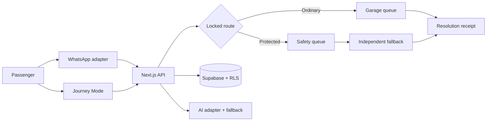

# IrinAbo

> Report once. Keep the journey informed. Make follow-up accountable.

IrinAbo is a WhatsApp-first journey reporting and coordination proof of concept. Passengers can attach a report to a departure, choose an identity-protected route when staff are involved, share optional location context, and see whether someone accepted the next action.

This repository contains a runnable fictional demonstration. It does not guarantee rescue, detect crime, provide continuous background tracking, dispatch an agency, or represent a verified transport operator.

## Working vertical slice

- Browser report simulator with fixed staff-involvement choice
- Locked ordinary/protected routing and access denial tests
- Original and conflicting source accounts side by side
- AI adapter with deterministic non-AI fallback
- Journey Mode and honest location lifecycle copy
- Distinct web and WhatsApp location source labels
- Acknowledgement states and authenticated server escalation worker
- Resolution receipt with append-only feedback
- Read-only Judge Mode with honest capability labels
- Supabase schema, RLS policies, fictional seed, and provider adapters
- Staff auth boundary with organisation-scoped dashboard access

## Local setup

Requires Node.js 20+ and pnpm.

```bash
pnpm install
cp .env.example .env.local
```

### Demo mode (no Supabase credentials)

Leave `NEXT_PUBLIC_SUPABASE_URL` and `NEXT_PUBLIC_SUPABASE_ANON_KEY` empty to run a labelled fictional demo.

```bash
pnpm dev
```

- Public routes (`/`, `/report`, `/journey/demo-tw204`, `/receipt/demo-receipt`, `/judge`) stay available.
- Dashboard routes stay functional with a clearly labelled demo identity.

### Connected mode (Supabase Auth + RLS)

1. Fill `.env.local` with `NEXT_PUBLIC_SUPABASE_URL`, `NEXT_PUBLIC_SUPABASE_ANON_KEY`, and `SUPABASE_SERVICE_ROLE_KEY`.
2. Set `NEXT_PUBLIC_APP_URL` (for local development: `http://localhost:3000`).
3. In Supabase Auth settings, add redirect URLs:
   - `http://localhost:3000/auth/callback`
   - your deployed callback URL (for example `https://your-host/auth/callback`)
4. Apply database changes in order:
   - `supabase/migrations/202609160001_initial.sql`
   - `supabase/migrations/202609190001_staff_auth_rls.sql`
   - `supabase/seed.sql`
5. Create staff users in Supabase Auth and matching `profiles` + `staff_assignments` rows.
6. Start the app with `pnpm dev` and sign in at `/staff/sign-in`.

Email/password and magic-link sign-in are both available. Magic links require `NEXT_PUBLIC_APP_URL` and matching Supabase redirect configuration.

## Verify

```bash
pnpm test
pnpm lint
pnpm build
```

## Demo route

1. Open `/report`, submit the seeded report, and select that staff are involved.
2. Open `/protected`, then case `IRN-204-031`.
3. Compare the original accounts and both location sources.
4. Open `/receipt/demo-receipt` and submit “This is not resolved.”
5. Open `/judge` to inspect live and simulated capability labels.

The fictional scenario uses Unity Transit Demo, vehicle UTD-07, and journey TW204 from Ikorodu Central Garage to Ibadan Main Garage.

## Architecture



Application rules choose access, routing, deadlines and recipients; AI cannot change them. Incoming text is untrusted data, Twilio webhooks require signature validation, provider IDs are unique, and protected access requires an explicit safety assignment.

Keep provider secrets server-side and use fictional data for judging.

See [project specification](docs/PROJECT_SPEC.md), [trust model](docs/TRUST_MODEL.md), [limitations](docs/LIMITATIONS.md), and [AI build log](docs/AI_BUILD_LOG.md). No licence has been added.
