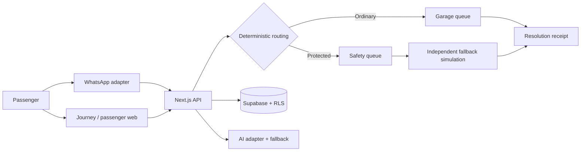

# IrinAbo

> Report once. Keep the journey informed. Make follow-up accountable.

IrinAbo is a WhatsApp-first journey reporting and coordination proof of concept. Passengers can attach a report to a departure, choose an identity-protected route when staff are involved, share optional location context, and see whether someone accepted the next action.

This repository contains a runnable fictional demonstration. It does not guarantee rescue, detect crime, provide continuous background tracking, dispatch an agency, or represent a verified transport operator.

## Submission snapshot

The deployed proof of concept includes:

- Authenticated company workspace and journey creation
- Passenger journey links and QR entry
- Passenger session creation and permission-based current-location snapshots
- Signed Twilio WhatsApp webhook with JOIN + text-report flow and idempotent message storage
- Locked ordinary/protected routing and role checks
- Persisted incident ownership and action audit events
- Original/conflicting source accounts in the demonstration scenario
- AI report-extraction adapter with deterministic non-AI fallback
- Server-side acknowledgement deadline/escalation worker (external call remains simulated)
- Resolution receipt with append-only feedback
- Read-only Judge Mode with explicit LIVE / SIMULATED / FICTIONAL / DEFERRED labels
- Supabase schema, migrations, RLS policies, fictional seed data and provider adapters

### Important scope boundaries

- The browser `/report` experience is a **labelled demonstration flow**; the seeded browser report itself is not the production WhatsApp ingestion path.
- WhatsApp **text** ingestion is implemented. Voice-note transcription and WhatsApp current-location ingestion are not part of the submitted live path.
- Browser passenger pages can persist a one-time current-location snapshot with permission.
- External voice escalation and public-agency dispatch are not live.
- Unity Transit Demo, its staff, passengers and incidents are fictional.

## Run locally

Requires Node.js 20+ and pnpm.

```bash
pnpm install
cp .env.example .env.local
pnpm dev
```

Open `http://localhost:3000`.

Without external credentials, the public demonstration pages and deterministic rules remain inspectable. Supabase-backed persistence, authenticated staff flows, Twilio and product-AI provider calls require the corresponding environment variables.

### Database setup

Apply **all SQL migrations in `supabase/migrations/` in filename order**, then apply `supabase/seed.sql` for the fictional TW204 demo data. Do not apply only the initial migration; later migrations add staff authentication, WhatsApp conversations, company staff, passenger sessions, incident assignment and journey creation permissions.

After configuration:

```bash
pnpm test
pnpm lint
pnpm build
```

## Recommended judge path

1. Open `/judge` first to see exactly what is live, simulated, fictional or deferred.
2. Open the passenger journey `/journey/TW204`.
3. Create a passenger session and optionally share one current browser location.
4. If the Twilio Sandbox is available, join it and send `JOIN TW204`, then a short text concern.
5. Use the authenticated staff workspace to review persisted incidents and accept responsibility.
6. Use the protected demonstration scenario `/protected` → `IRN-204-031` to inspect conflicting accounts and protected routing.
7. Open `/receipt/demo-receipt` and record whether the outcome matches what happened.

## Architecture



Application rules choose access, routing, deadlines and recipients; AI cannot change them. Incoming text is treated as untrusted data, Twilio webhooks require signature validation, provider message IDs are deduplicated, and protected access requires the safety role.

## AI development

Codex was used as the primary coding agent for scaffolding, implementation, migrations, tests, debugging, documentation and deployment fixes. The repository owner supplied the original product concept, safety constraints, scope decisions and human oversight. See [AI build log](docs/AI_BUILD_LOG.md) and [AI-assisted decisions](docs/AI_DECISIONS.md).

See also the [project specification](docs/PROJECT_SPEC.md), [trust model](docs/TRUST_MODEL.md), [limitations](docs/LIMITATIONS.md), and [demo script](docs/DEMO_SCRIPT.md).

No licence has been added.
