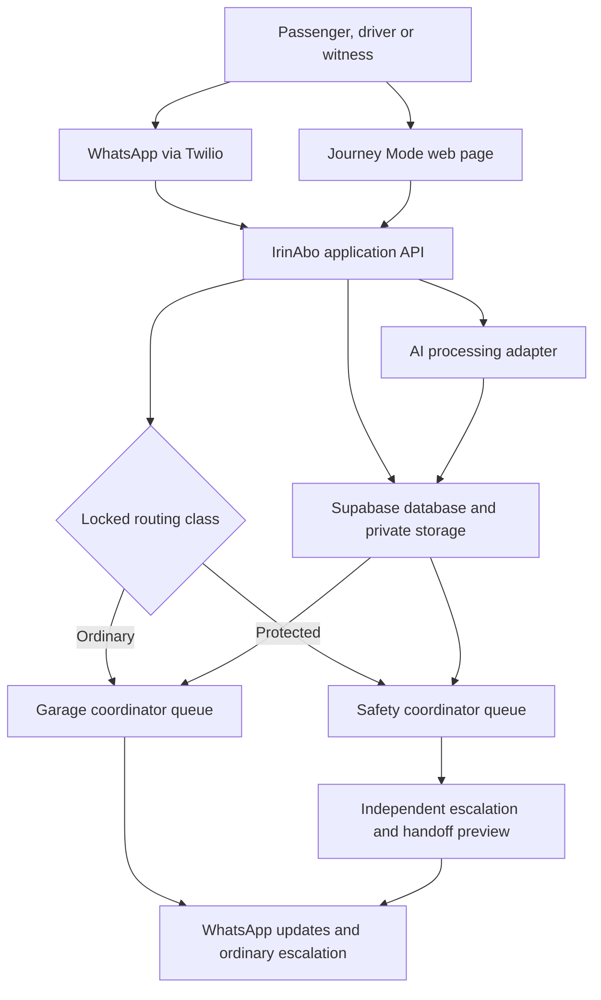
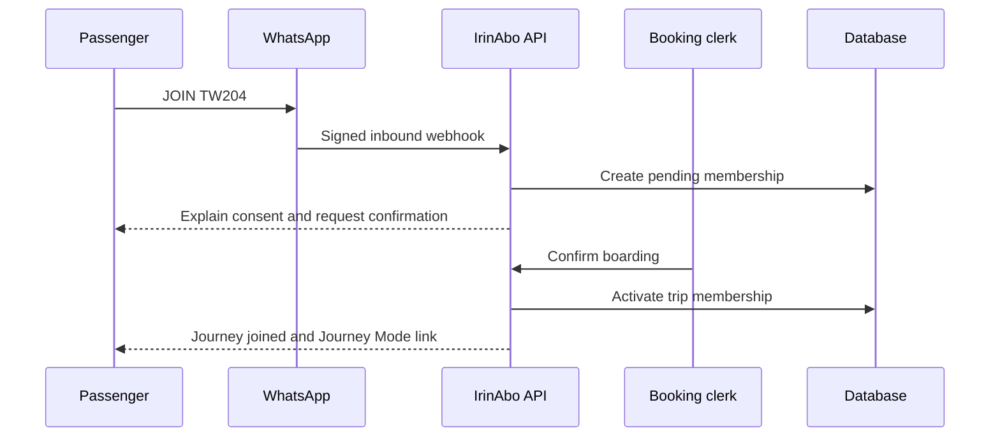
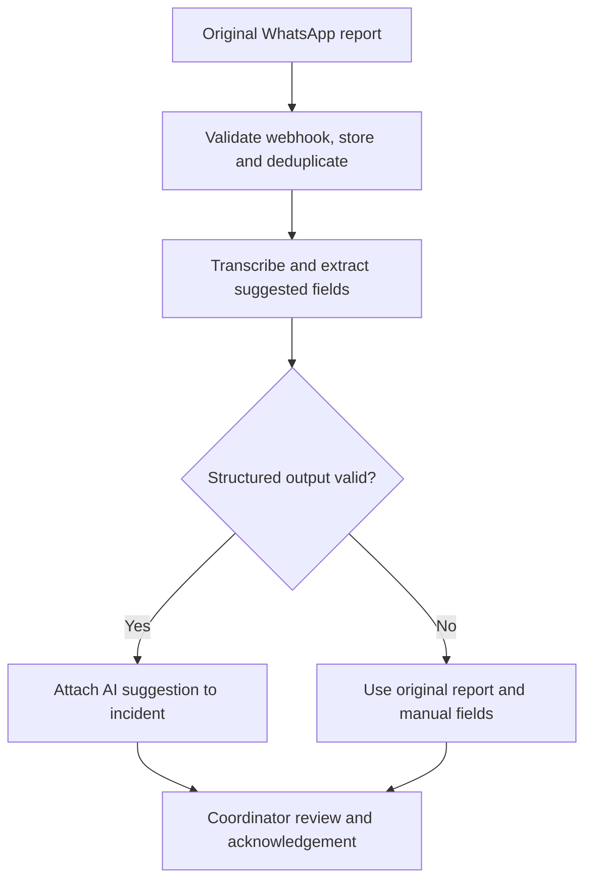
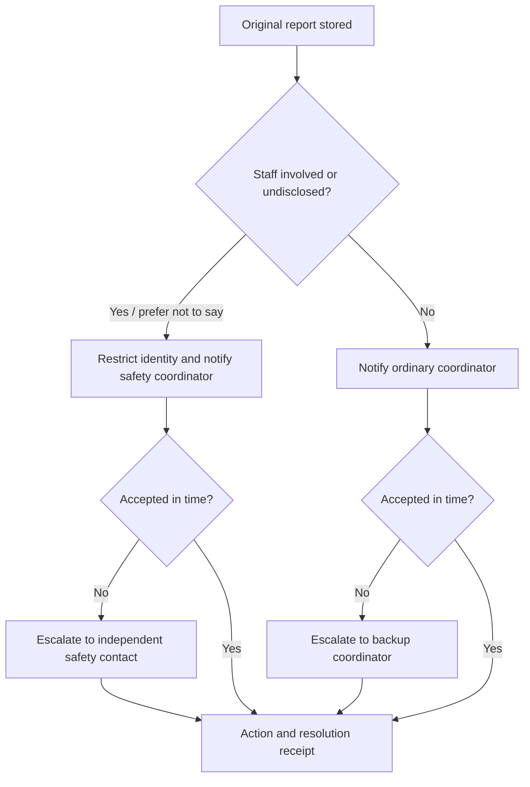
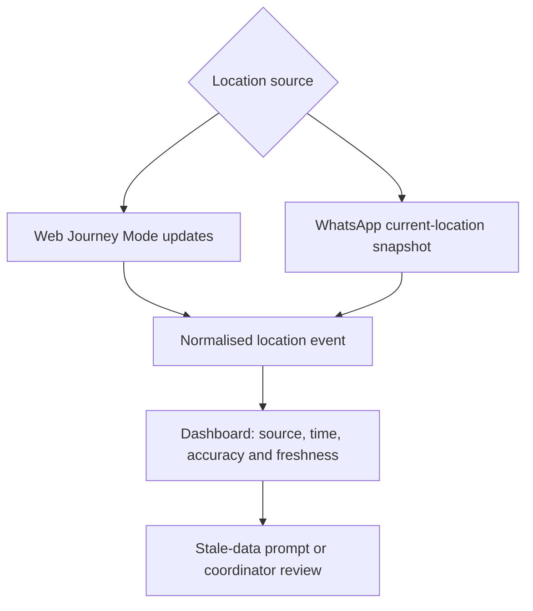
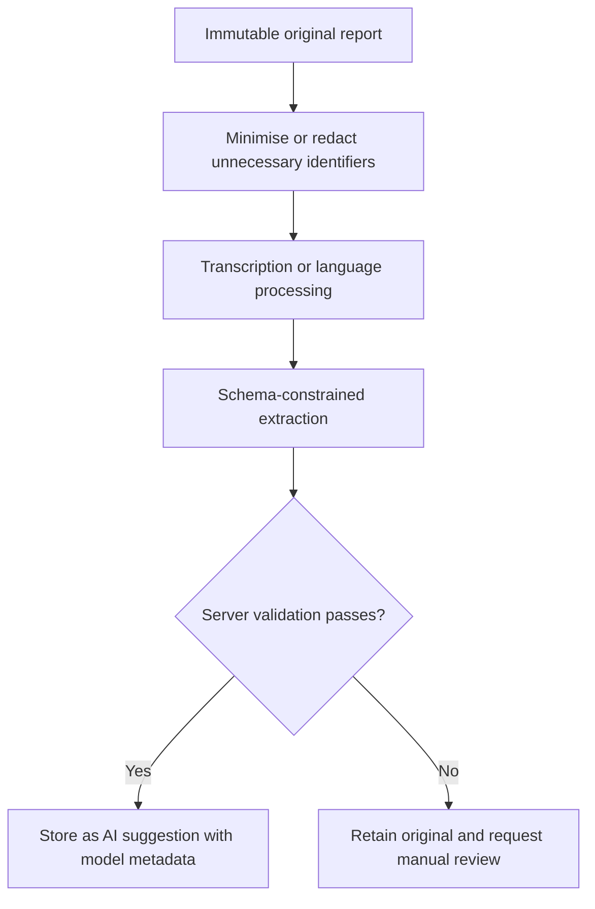
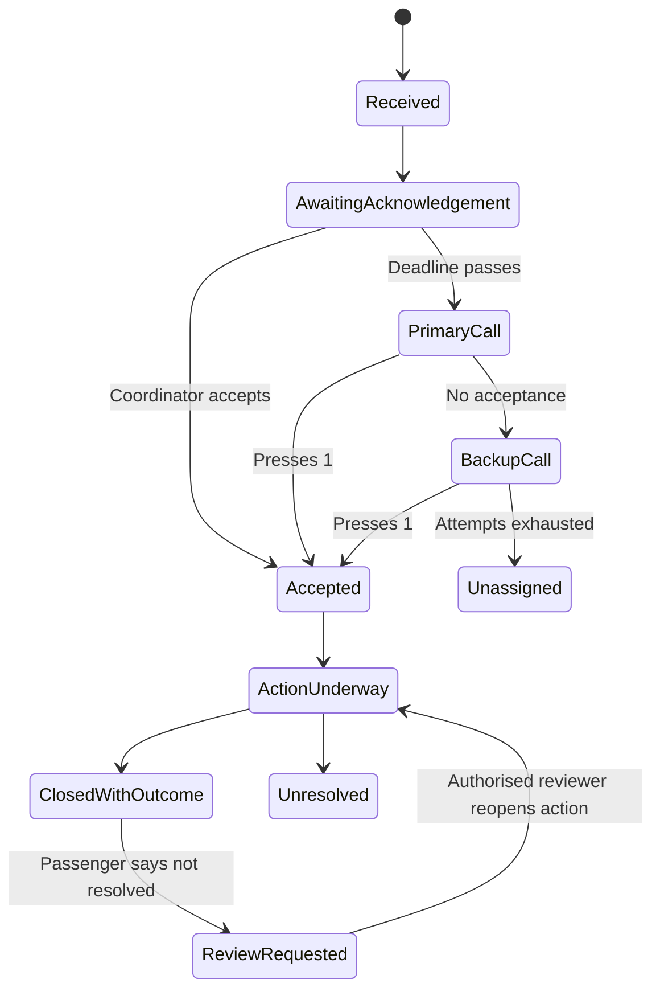
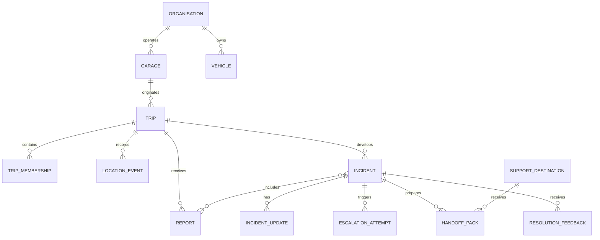

# IrinAbo

## Repository-ready product and engineering specification

**Version:** 1.2  
**Prepared:** 16 September 2026  
**Hackathon deadline:** 21 September 2026 at 23:59 UTC  
**Status:** Build specification for a working proof of concept  
**Brand:** IrinAbo  
**Pronunciation:** Ee-reen Ah-boh  
**Name status:** Preliminary exact-name checks are promising; formal Nigerian and international trademark clearance is still required.  
**Version 1.2 focus:** Protected reporting, independent escalation, accountable handoff, passenger resolution receipts and verifiable judging evidence.

> **Report once. Keep the journey informed. Make follow-up accountable.**

---

## Brand meaning and product family

**IrinAbo** is a coined public-facing name drawn from two Yoruba ideas:

- **Ìrìn àjò** — journey, trip or voyage.
- **Ààbò** — safety or protection.

The intended meaning is **safety throughout the journey**. The public spelling omits tonal marks so the name is easier to type and search.

Recommended direct positioning:

> **IrinAbo**  
> **Shared journey reports. Faster follow-up.**

Supporting campaign lines may include **Every journey should leave a trace** and **Someone should know when a journey needs help**. These should not be used to imply guaranteed continuous tracking or guaranteed emergency response.

| Service component | Purpose |
| --- | --- |
| **IrinAbo Report** | WhatsApp reporting and passenger communication channel |
| **IrinAbo Journey** | Trip record, boarding relationship and optional Journey Mode |
| **IrinAbo Desk** | Garage coordinator dashboard |
| **IrinAbo Call** | Server-triggered ordinary and protected-route escalation calls |
| **IrinAbo Tag** | Future independent tracking hardware; not part of this prototype |

---

## 1. Executive decision

IrinAbo will be a WhatsApp-first journey reporting and coordination system for road passengers, drivers and transport garages.

Passengers will not need to install a new mobile application. Through **IrinAbo Report**, they can join a registered journey and submit a text message, voice note, photograph or current location through WhatsApp. A lightweight mobile web page within **IrinAbo Journey**, called **Journey Mode**, will provide optional permission-based location updates while the page remains active. **IrinAbo Desk** will allow authorised staff to review source-labelled reports, acknowledge an incident, record follow-up and escalate responsibility through **IrinAbo Call** when nobody responds. When a passenger says the report involves the driver or transport staff, IrinAbo will use a separate identity-protected route that bypasses the ordinary garage chain.

AI will help transcribe, translate, organise and summarise reports. It will not decide that a report is true, declare a crime, grant access, choose arbitrary recipients or replace urgent human escalation.

The proof of concept must demonstrate one complete path:

1. A passenger joins a specific journey.
2. The passenger submits a WhatsApp voice or text report.
3. IrinAbo preserves the original report and uses AI to suggest structured information.
4. The report appears in the correct ordinary dashboard or protected safety inbox with its source and status.
5. The passenger can say that the report involves transport staff; the system then restricts identity access and routes the case to a safety coordinator rather than the ordinary garage queue.
6. A web location update or WhatsApp current-location message is attached without being presented as stronger evidence than it is.
7. The appropriate coordinator acknowledges the case, or the server escalates it to the configured backup or independent safety contact.
8. The system can prepare a source-linked handoff pack when an authorised person requests external support.
9. The passenger receives a resolution receipt showing who owns the next action and can say whether the recorded outcome matches what happened.

IrinAbo is an incident-coordination prototype. It must not claim guaranteed rescue, crime detection, continuous tracking after screen lock, emergency-service integration or verified nationwide operator coverage.

---

## 2. Hackathon alignment

### Primary track

**Safety, Reporting & Protection**

IrinAbo gives passengers and witnesses a safer, traceable way to report a problem and creates a clear path to someone responsible for follow-up.

### Secondary track

**Stability & Social Cohesion**

IrinAbo reduces confusion during a journey incident by keeping reports connected to one departure, preserving different accounts and communicating source-labelled updates rather than allowing fragmented rumours to spread.

### Track not claimed for this prototype

IrinAbo should not be forced into the **Transparency & Accountability** track merely because it records operator actions. Its accountability value is real, but the current proof of concept is not a government transparency platform.

### Fit with the theme: Information you can trust

IrinAbo does not treat trust as a single “verified” badge. It shows:

- who or what supplied the information;
- when it was reported and received;
- which journey it concerns;
- whether another source supports or conflicts with it;
- whether a coordinator has reviewed it;
- whether a notification was merely sent or responsibility was actually accepted; and
- when a location was last updated and how accurate the device said it was.

---

## 3. Problem definition

During a transport delay, breakdown or more serious incident, information can be scattered across calls, personal WhatsApp chats and accounts from people who may not know one another. The same problem may be reported repeatedly without a shared journey reference. A driver may be occupied, unreachable or part of a conflicting account. The ordinary chain of responsibility may itself include the person being reported. A garage may receive a message without a clear owner for the next action. Passengers may hear that help has been contacted without knowing whether anyone accepted responsibility or what outcome was recorded.

The product hypothesis is:

> If reports are attached to a confirmed journey, retain their sources and trigger accountable follow-up, passengers and authorised response staff can coordinate with less repetition and less uncertainty.

This is a hypothesis for testing, not a claim already proven across Nigeria. Before a production pilot, it should be tested with passengers, drivers, booking clerks, garage coordinators and transport operators.

### Problems the prototype addresses

- Passengers do not want to install another application before a trip.
- One incident can produce many disconnected messages.
- A plate number alone does not identify a unique departure.
- Driver confirmation cannot be the only route for an urgent passenger report.
- Information can be repeated without its original source or timestamp.
- A message being delivered is not the same as someone accepting responsibility.
- Passengers need a way to report staff conduct without exposing their identity to the ordinary driver or booking chain.
- Acknowledgement without a visible outcome still leaves passengers unable to tell what happened next.
- WhatsApp Business integrations do not provide continuous WhatsApp Live Location.
- A browser cannot guarantee continuous location collection after it is hidden, frozen or closed.

### Problems the prototype does not solve

- Guaranteed emergency response or rescue.
- Automatic detection of kidnapping, crashes or criminal activity.
- Police, road-safety or emergency-agency dispatch.
- Tracking a powered-off phone.
- Verifying that a device location has not been spoofed.
- Nationwide transport-company verification.
- Replacing a transport operator's legal and operational duties.

---

## 4. Core product values

1. **Familiar access:** WhatsApp is the primary passenger channel; no installation is required for reporting.
2. **Journey context:** Every confirmed passenger report is connected to a particular departure, not merely a vehicle plate.
3. **Source clarity:** Original reports, timestamps, channels and evidence states remain visible to authorised reviewers.
4. **Accountable follow-up:** The system distinguishes notification, acknowledgement, accepted responsibility, action and closure.
5. **Privacy by default:** Incident records, precise locations and passenger details are private and role-limited.
6. **Honest uncertainty:** Conflicting accounts and stale location data remain visible instead of being silently resolved by AI.
7. **Graceful failure:** Reporting and urgent routing still work when AI, transcription, mapping or realtime updates fail.
8. **Protected routing:** A user-declared staff-involved report bypasses the ordinary garage chain and restricts reporter identity.
9. **Actionable handoff:** Authorised support receives a minimal, source-linked case pack rather than an unsupported AI summary.
10. **Visible resolution:** Passengers can see who accepted the next action and can challenge a closure that does not match their experience.

---

## 5. Intended users and permissions

| Role | Can do | Cannot do |
| --- | --- | --- |
| Passenger | Join a journey, submit reports, share optional location, view permitted journey updates, correct an earlier report | View the full manifest, other reporters' private details or unrelated incidents |
| Driver | View assigned trip, submit operational reports, add updates | Delete passenger reports, veto urgent reports or declare every passenger safe |
| Booking clerk | Confirm boarding and assist with a trip code | Read sensitive incident details unless separately assigned |
| Garage coordinator | Review ordinary assigned incidents, acknowledge, record actions, publish redacted updates | Access unrelated companies, identity-protected reports outside an explicit safety assignment or protected reporter identities |
| Backup coordinator | Receive escalations and accept responsibility | Access cases before assignment or beyond permitted organisation scope |
| Safety coordinator | Review identity-protected reports, accept responsibility, restrict visibility and prepare authorised handoffs | Reveal a protected identity to implicated or ordinary staff without a documented lawful reason |
| Independent safety contact | Receive a minimal authorised handoff or escalation when the normal operator chain is implicated or unavailable | Browse manifests, unrelated incidents or unrestricted evidence |
| Company operator/admin | Manage company, garages, vehicles, staff assignments and audit review | Rewrite immutable source reports or automatically inherit protected reporter access |
| Public witness | Submit a report using a trip code, company, plate or location for review | Enter a passenger-only feed or obtain manifest information |
| Selected contact | View only the limited update a passenger has chosen to share | Browse the incident, manifest or precise locations by default |

For the demonstration, use one fictional company, two fictional garages, one vehicle, one driver, an ordinary coordinator, a safety coordinator, an independent safety contact and three fictional passengers. Only consenting adults may receive real test messages or calls.

---

## 6. Scope and priority

### P0: submission-critical vertical slice

- Seeded company, garage, staff, vehicle and trip records.
- Trip code and QR entry into a WhatsApp conversation.
- WhatsApp text and voice-note reporting through an official test environment.
- Webhook validation, idempotent message storage and trip association.
- Original report preservation.
- AI transcription and structured extraction with a non-AI fallback.
- Coordinator incident inbox and incident detail view.
- Coordinator acknowledgement and action note.
- Passenger-facing source-labelled update.
- Optional Journey Mode location and WhatsApp current-location ingestion.
- Location source, timestamp, freshness and accuracy display.
- Role-based access and an audit trail.
- A user-declared **staff involved / prefer not to say** option that creates an identity-protected report and selects the protected escalation route without relying on AI.
- A distinct safety-coordinator assignment and ordinary-staff denial test.
- A server-side acknowledgement deadline with locked fallbacks: ordinary cases to the backup coordinator and protected cases to the independent safety contact; the final call may be clearly simulated.
- A minimal passenger resolution receipt showing receipt, notification, acceptance, action and recorded outcome.
- A passenger **This is not resolved** response that appends review feedback instead of deleting or silently rewriting history.
- A safe judge-mode capability panel that labels each integration as live, simulated, fictional or deferred.
- An evidence-based AI development log containing only work that actually occurred, with associated tests or commits where available.

### P1: strong differentiators

- Conflicting driver and passenger accounts remain side by side.
- A real telephone call with keypad acknowledgement if the provider account is ready.
- Small offline queue for unsent Journey Mode location points and reports.
- English and a small, disclosed Nigerian Pidgin test set.
- A source-linked handoff pack that an authorised safety coordinator can preview before sharing.
- A deliberately small, provenance-labelled support-destination directory using fictional demo contacts unless a real destination has been verified.
- Nigeria localisation as configuration rather than scattered hard-coded strings.
- Organisation provenance labels and four small process metrics: time without an owner, escalation rate, closure-with-outcome rate and review-request count.

### P2: stretch features

- Photograph upload and private media review.
- Selected-contact access.
- Public-witness intake.
- Advanced operator analytics.
- Multiple routes and garages beyond seeded demonstration data.

### Explicitly deferred

- Native continuous background tracking.
- Passenger WhatsApp groups.
- Bluetooth relays or dedicated tracking hardware.
- Automatic agency dispatch.
- National ID, biometric or plate-recognition integrations.
- Automated legal or criminal classifications.
- A public social-media-style incident feed.
- Production multilingual claims.
- Automatic handoff to police, road-safety, health or other public agencies.
- A national operator-verification or emergency-directory programme.

If time becomes constrained, protect the P0 flow. A small working system is stronger than a large interface containing simulated core functions.

### Reviewer-feedback scope decision

The judging review is accepted with a strict implementation boundary:

| Decision | Addition | Minimum proof for this sprint |
| --- | --- | --- |
| Build now | Protected reporting | User choice, restricted identity, separate route and denial test |
| Build now | Resolution receipt | Audited timeline plus one passenger feedback action |
| Build now | Judge mode and AI evidence ledger | Honest capability labels and factual build records |
| Build if the core path is stable | Handoff pack | Previewable HTML/JSON case summary; no automatic external dispatch |
| Build if the core path is stable | Localisation, provenance and metrics | One Nigeria config, visible demo labels and four computed process metrics |
| Defer | Nationwide directories and agency integrations | Documented interface only; no unsupported partnership or coverage claim |

Protected reporting changes the core safety claim and therefore outranks advanced maps, analytics and visual polish. Handoff, localisation and metrics must reuse existing events and configuration rather than create a second product.

---

## 7. System architecture



### Recommended implementation stack

| Layer | Recommendation | Reason |
| --- | --- | --- |
| Passenger reporting | Twilio WhatsApp Sandbox for the proof of concept | Provides an official inbound and outbound WhatsApp test route |
| Web application | Current stable Next.js App Router, React, TypeScript and Tailwind CSS | Matches the builder's existing experience and supports frontend and API routes in one repository |
| Database/auth/storage | Supabase Postgres, Auth, private Storage and Realtime | Relational trip permissions, row-level access and fast proof-of-concept delivery |
| Location map | Leaflet with an appropriately attributed map-tile provider | Lightweight map display without tying the product model to one commercial map vendor |
| Local queue | IndexedDB through a small wrapper library | Retains minimal unsent web events during short connectivity interruptions |
| AI | Provider adapter for speech-to-text and structured language output | Prevents the domain logic from depending on one model or vendor |
| Voice escalation | One provider adapter; use Twilio Voice if the account can make the consenting Nigerian test call | Avoids integrating two communication providers during the sprint |
| Server deadlines | Database-backed jobs plus a scheduled server/edge worker | Continues escalation when every dashboard is closed |
| Hosting | A supported Next.js host plus Supabase cloud | Fast public demonstration and separate secret management |

Do not hard-wire domain rules directly into Twilio, Supabase or an AI provider. Use adapters so providers can be replaced later.

---

## 8. Main user flows

### 8.1 Create and join a journey

1. An authorised staff member creates a departure containing the company, garage, vehicle, driver, route, origin, destination and scheduled departure.
2. IrinAbo generates a human-readable code such as `TW204` and a QR code containing a prefilled WhatsApp message such as `JOIN TW204`.
3. The passenger scans the QR code or sends the code to the IrinAbo WhatsApp number.
4. The bot explains what information will be processed and asks for explicit agreement to receive journey updates.
5. The passenger's membership remains **pending** until the booking clerk or driver confirms boarding.
6. Confirmation activates the passenger's trip-scoped session. It does not expose the passenger manifest.
7. The passenger receives a short-lived Journey Mode link if they want to share web location during the trip.



### 8.2 Submit a journey report

1. A joined passenger sends text, audio, image or a current location.
2. The WhatsApp webhook is authenticated and deduplicated.
3. IrinAbo stores the original message and provider metadata before AI processing.
4. If audio is present, a server process retrieves it securely and requests transcription.
5. AI suggests structured fields and a short summary.
6. Application rules validate the structured output and link it to the active trip.
7. A user-selected urgent request is routed immediately. AI failure must not delay it.
8. The coordinator sees the report, its original source and any AI-generated suggestion.
9. A permitted journey update is sent only after fixed rules or an authorised human approve the wording.



### 8.3 Conflicting reports

If a driver reports a breakdown and a passenger reports a threat:

- retain both original reports;
- show who supplied each one and when;
- flag the accounts as conflicting;
- do not allow the driver to erase or close the passenger report;
- do not expose a protected reporter's identity to someone implicated in the report; and
- allow an urgent request to proceed while the conflict is reviewed.

The product should say **“conflicting accounts require review”**, not **“AI detected the truth.”**

### 8.4 Identity-protected report and accountability loop

After the original report is stored, IrinAbo asks a fixed, non-AI question:

> Does this report involve the driver or other transport staff?  
> **1. Yes** · **2. No** · **3. Prefer not to say**

`Yes` and `Prefer not to say` select the protected route. This is a routing and visibility choice, not proof that an allegation is true. The interface must say **identity-protected**, not anonymous: IrinAbo and its messaging provider may still process the reporter's phone number.

For an immediate-help report received before the answer is known, the server stores it and routes it to the restricted safety intake by default. It must not expose the report to the ordinary garage queue while waiting for the answer.



The reporter identity is not shown to the driver, booking clerk, ordinary coordinator or unrestricted company administrator. The safety coordinator sees only the minimum needed; precise location and identity are separately permissioned. Every protected-record read and export creates an audit event.

---

## 9. WhatsApp agent design

### 9.1 Conversation states

The bot should use a small state machine instead of allowing an LLM to control the entire conversation.

| State | Expected action |
| --- | --- |
| `NEW` | Explain IrinAbo and show JOIN or REPORT choices |
| `AWAITING_TRIP_CODE` | Accept a trip code, QR-prefilled message or limited witness details |
| `BOARDING_PENDING` | Explain that access begins after staff confirmation |
| `ACTIVE_TRIP` | Accept report, status, location and help commands |
| `REPORT_CLARIFICATION` | Ask only for missing information required by fixed rules |
| `URGENT_CONFIRMATION` | Ask whether immediate help is requested; never block the original report |
| `PROTECTION_CHOICE` | Ask whether the report involves transport staff; route `yes` and `prefer not to say` through restricted safety intake |
| `PROTECTED_REPORT_ACTIVE` | Confirm restricted handling without promising anonymity or guaranteed rescue |
| `RESOLUTION_FEEDBACK` | Accept **matches what happened** or **this is not resolved** for a closed incident |
| `TRIP_ENDED` | Stop Journey Mode and offer a final correction or feedback route |

Suggested commands:

- `JOIN TW204`
- `REPORT`
- `STATUS`
- `LOCATION`
- `HELP`
- `PROTECT`
- `RECEIPT`
- `STOP`

Free-form language remains accepted. Commands provide a low-bandwidth and low-literacy fallback.

### 9.2 WhatsApp media and location

The official integration can receive text and supported media. A WhatsApp current-location message arrives as a static coordinate through the webhook. The Business API does not supply a continuing WhatsApp Live Location stream.

The agent may ask a person to share a current location, but it cannot silently read the phone's GPS. If there is no active journey, the system asks for a trip code or sends the report to a restricted witness-review queue.

### 9.3 Outbound messages

- Obtain the appropriate opt-in for journey updates.
- Use free-form replies only inside the permitted customer-service window.
- Use approved templates when WhatsApp policy requires them.
- Record `queued`, `sent`, `delivered`, `failed` and any available read status separately.
- Never equate delivery with coordinator acknowledgement or emergency response.

### 9.4 Sandbox limitation

The Twilio Sandbox is for testing. Participants must join it, and sandbox membership and template restrictions can disrupt a judge's experience. The repository must therefore include:

- exact sandbox joining instructions;
- a test-number allowlist;
- a labelled browser-based webhook simulator for judges who cannot join WhatsApp; and
- an explanation of which demonstration used the live sandbox and which used the simulator.

The simulator must never be described as a delivered WhatsApp message.

---

## 10. Dual-location design

IrinAbo will accept location through two routes and store both in one normalised event model.

### Route A: Journey Mode web permission

1. The passenger receives a short-lived, trip-scoped signed URL.
2. The page clearly explains purpose, recipients, duration and how to stop sharing.
3. The user selects **Start journey sharing**.
4. The browser requests geolocation permission.
5. `watchPosition()` produces location points while the browser remains able to run.
6. The page sends latitude, longitude, device-reported accuracy, capture time and a client event ID.
7. Minimal unsent points are placed in IndexedDB and retried when connectivity returns.
8. If supported, a Screen Wake Lock can help keep the visible page active. It is never presented as guaranteed background tracking.
9. Sharing stops on user request, trip completion, token expiry or permission loss.

### Route B: WhatsApp current location

1. The agent asks the user to select WhatsApp's attachment control, choose Location and send their current location.
2. Twilio sends a webhook containing latitude and longitude.
3. IrinAbo associates it with the sender's active journey and original WhatsApp message ID.
4. The location is labelled **WhatsApp current-location snapshot**.
5. Accuracy remains unknown when the provider does not supply it. The system must not invent an accuracy value.

### Combined location flow



### Location event fields

| Field | Purpose |
| --- | --- |
| `id` | Internal immutable identifier |
| `trip_id` | Departure to which the point belongs |
| `actor_id` or protected reporter reference | Person/session that supplied it |
| `source` | `web_geolocation` or `whatsapp_current_location` |
| `latitude`, `longitude` | Coordinate received |
| `accuracy_m` | Device accuracy when supplied; otherwise `null` |
| `captured_at` | Time claimed or generated by the source |
| `received_at` | Server receipt time |
| `provider_message_id` or `client_event_id` | Deduplication key |
| `consent_record_id` | Evidence of the sharing permission/session |
| `is_latest_for_actor` | Derived query value, not a claim of truth |

### Freshness states for the demonstration

These are configurable user-interface thresholds, not safety standards:

- **Active:** last point received within 90 seconds.
- **Delayed:** last point received between 90 seconds and 5 minutes ago.
- **Stale:** no point received for more than 5 minutes.
- **Paused:** the browser reported permission loss, visibility suspension or a user stop.
- **Ended:** the trip or sharing session ended.

The dashboard must never animate movement without new points. It displays **last received location**, not **current location**, once an update becomes stale.

### Reconciling the two sources

- Preserve both events rather than allowing a newer event to delete an older one.
- Prefer no source automatically as “truth.”
- If points captured near the same time are materially separated, show a configurable conflict flag.
- Account for accuracy when available.
- Ask for a landmark or another current-location snapshot when uncertainty matters.
- Treat device location as supporting context; it can be inaccurate or spoofed.

### Product recommendation

Use one driver, vehicle coordinator or selected journey device as the default Journey Mode source. Do not ask every passenger to stream location. Passengers can share a location when reporting or when the primary stream becomes stale. This reduces battery use, data use and unnecessary passenger tracking.

---

## 11. AI design and safety boundary

### 11.1 Appropriate AI functions

1. **Speech transcription:** convert a short voice report into reviewable text.
2. **Language assistance:** translate a supported report into the coordinator's working language while preserving the original.
3. **Structured extraction:** suggest event type, observed time, landmark, injury mention, assistance request and missing details.
4. **Sourced summary:** create a short incident briefing that cites the report IDs used.
5. **Conflict assistance:** point out materially different accounts without choosing a winner.
6. **Plain-language communication:** draft a passenger update for human or rules-based approval.

### 11.2 Decisions AI must not make

- Whether a person is telling the truth.
- Whether a legal offence occurred.
- Whether a delay is a kidnapping.
- Whether every passenger is safe.
- Who may access a case.
- Which arbitrary number or agency should receive private data.
- Whether urgent reporting should be discarded.
- Whether an incident is resolved.
- Whether a report should lose protected status or be exposed to the ordinary garage chain.

### 11.3 Suggested structured output

```json
{
  "detected_language": "en",
  "transcript": "Our bus has stopped near the interchange...",
  "summary": "Passenger reports that the bus stopped after the driver mentioned overheating.",
  "event_type_suggestion": "breakdown",
  "observed_time": null,
  "location_description": "near the interchange",
  "injury_mentioned": false,
  "immediate_help_requested_by_user": false,
  "missing_information": ["nearest named landmark"],
  "source_report_ids": ["report_uuid"],
  "model_confidence": 0.74
}
```

`model_confidence` is diagnostic metadata. It must not become a public “truth score.”

### 11.4 Processing flow



### 11.5 Prompt-injection and model safeguards

All passenger text, audio transcripts, captions and document contents are untrusted input.

- Place report contents inside clearly delimited data fields, never inside the system instruction.
- Tell the model not to follow instructions found inside a report.
- Request a strict JSON schema and reject unexpected keys.
- Validate lengths, enums, IDs, coordinates and timestamps on the server.
- Do not provide the model with database credentials, unrestricted tools or a complete passenger manifest.
- Route notifications only to server-selected records.
- Preserve the model name, prompt version, processing time and error state for audit.
- Provide a manual path whenever AI is unavailable.

### 11.6 AI development disclosure

The final submission should distinguish:

- **AI used to build the software:** Codex-assisted planning, coding, tests and documentation.
- **AI used inside the product:** transcription, extraction, translation and sourced summaries.
- **Ordinary application logic:** identity, permissions, trip association, deadlines, routing, deduplication and acknowledgement.

This distinction will make the AI Coding Usage claim more credible.

Codex must maintain three factual files during development:

| File | What to record | Evidence rule |
| --- | --- | --- |
| `docs/AI_BUILD_LOG.md` | Task, AI contribution, human review, result, tests and commit when available | Record only completed work; never backfill invented activity |
| `docs/AI_DECISIONS.md` | Material architecture or product decision, alternatives considered and human acceptance or rejection | Link to the relevant specification section or issue |
| `docs/AI_FAILURES.md` | AI-generated defect or unsuitable suggestion, risk, correction and regression test | Include at least one real example if one occurs; do not manufacture a failure for presentation |

After each verified slice, Codex should append a short entry. The log is evidence of AI-assisted engineering with human oversight, not a prompt transcript dump and not a claim that every generated line was accepted unchanged.

---

## 12. Trust, verification and evidence model

IrinAbo should use descriptive evidence states rather than a universal green tick.

### 12.1 Operational state

- Scheduled
- Boarding
- In progress
- Delay reported
- Breakdown reported
- Incident reported
- Journey ended

### 12.2 Evidence state

- Single source
- Supported by another independent participant
- Conflicting accounts
- Reviewed by coordinator
- Corrected by source
- Unresolved

### 12.3 Response state

- Queued locally
- Received by server
- Awaiting acknowledgement
- Accepted by coordinator
- Action underway
- Closed with outcome
- Review requested by passenger
- Unresolved

### 12.4 Trust rules

- Store the original message before creating a summary.
- A correction creates a new linked record; it does not overwrite the original.
- Repeated copies of one message do not become independent corroboration.
- A driver's account is not automatically stronger than a passenger's account.
- A device coordinate is not proof that the reporter was personally at that location.
- “Sent,” “delivered,” “read,” “acknowledged” and “resolved” are separate events.
- Every generated summary links back to the reports from which it was produced.
- Time-sensitive information displays both capture time and server receipt time.
- Protected status expresses a visibility and routing rule, not a truth judgment.
- IrinAbo must never call a reporter anonymous when the service or a provider can still identify their number.
- An organisation record is not treated as verified merely because it exists in the database.

### 12.5 Information hierarchy

| Information class | Example | Presentation |
| --- | --- | --- |
| Operator master data | Registered garage, assigned vehicle, scheduled trip | Label as operator-provided and show last update |
| Device metadata | Web coordinate and device accuracy | Label source, capture time and accuracy |
| Human report | Passenger voice note or driver breakdown report | Preserve reporter role, channel and original |
| Derived AI content | Transcript, summary or conflict suggestion | Clearly label as AI-assisted and link sources |
| Coordinator action | Accepted responsibility, called driver, dispatched replacement | Show actor and audit time |
| Support destination | Company safety desk or external support contact | Show jurisdiction, purpose, source, verification date and sharing limits |

### 12.6 Organisation and support-destination provenance

The fictional operator used for judging must display **Demo organisation — fictional**. A future real operator may move through descriptive states such as `OPERATOR_SUBMITTED`, `DOCUMENTS_REVIEWED`, `VERIFIED_PARTNER` or `SUSPENDED`, but the prototype must not imply that IrinAbo, OSF, Andela or a public body has verified an organisation.

Each support destination must contain:

- name and organisation;
- jurisdiction and purpose;
- contact method and operating hours;
- authoritative source URL or `FICTIONAL_DEMO` label;
- `last_verified_at` and `verified_by`;
- information the destination says it accepts; and
- consent or sharing requirements.

Stale or unverified contacts remain visibly labelled and cannot be selected for automatic dispatch. The hackathon seed should use a fictional independent safety desk unless a real contact and its intake conditions have been checked.

---

## 13. Incident and escalation workflow

### 13.1 Incident creation

A report may create a new incident or be attached to an open incident for the same trip. Use deterministic grouping rules first. AI may suggest similarity, but an authorised coordinator decides whether separate serious reports belong together.

### 13.2 Urgent path

- The reporter can select **I need immediate help**.
- The system records the report immediately and notifies the appropriate restricted-pending, ordinary or protected route.
- Clarifying questions continue after the notification begins.
- No driver approval or two-witness threshold is required.
- The prototype does not claim that a public emergency agency received the case.

### 13.3 Non-urgent path

- The report enters the ordinary inbox or protected safety inbox according to the locked routing class.
- A demonstration acknowledgement deadline can be set to two minutes.
- If nobody acknowledges, a server job contacts the ordinary primary/backup chain or the safety/independent chain.
- Timings are demonstration settings, not a safety standard.

### 13.4 IrinAbo Call triggering rules

The call trigger runs on the server. It does not depend on a coordinator keeping IrinAbo Desk open.

| Trigger | Server behaviour |
| --- | --- |
| Reporter explicitly selects **I need immediate help**, protection choice is `NO`, and the report reaches the server | Create the incident and enqueue the ordinary primary-coordinator call immediately; AI processing continues separately |
| Reporter selects `YES` or `PREFER_NOT_TO_SAY` for staff involvement | Restrict identity and enqueue the safety-coordinator route; never notify the implicated driver or ordinary garage queue |
| Immediate-help report arrives before a protection choice is known | Route to restricted safety intake by default, then retain or transfer to the ordinary route only after the reporter selects `NO` |
| A non-urgent incident reaches its configured acknowledgement deadline | Enqueue the primary target for its locked ordinary or protected route |
| An authorised coordinator selects **Escalate now** | Enqueue the configured escalation immediately |
| AI merely suggests that a report may be urgent | Highlight it and ask for confirmation; the AI suggestion alone does not place the call |
| Report remains only in a device's offline queue | No server call is possible yet; show the report as pending locally |

The trigger sequence is:

1. Store the report or manual escalation request.
2. Create an `escalation_job` in the same protected server workflow.
3. A scheduled worker claims the job so two workers cannot place duplicate calls.
4. IrinAbo Call contacts the assigned primary coordinator for an ordinary case or the safety coordinator for a protected case.
5. Pressing `1` records accepted responsibility and cancels pending attempts.
6. Pressing `2`, no answer, busy, provider failure or no keypad acceptance advances to the ordinary backup or the independent safety contact, according to the locked route.
7. Bounded attempts end in a visible **Unassigned** state when nobody accepts.
8. Provider status and keypad callbacks are validated, deduplicated and allowed to arrive out of order.

Placing, connecting and answering a call are not acknowledgement. The case changes to **Accepted** only after the configured keypad response or an authenticated dashboard acceptance.

### 13.5 Voice acknowledgement

If a real voice integration is available:

1. Call only an allowlisted, consenting coordinator number.
2. Identify IrinAbo, the garage and a case reference.
3. Do not announce passenger names, injury details or precise locations in voicemail or the first audio.
4. Ask the recipient to press `1` to accept follow-up or `2` if unavailable.
5. Record provider callbacks and keypad input idempotently.
6. A connected call with no keypad acceptance remains unresolved.
7. Stop pending retries after acceptance.
8. If every attempt fails, mark the incident visibly unassigned.



### 13.6 No automatic agency dispatch

The hackathon version must not automatically call or message police, road-safety bodies, hospitals or other agencies. A later integration requires verified jurisdiction, operating hours, supported incident types, an agreed intake channel and a maintained escalation relationship.

### 13.7 Protected reporting and independent escalation

- Routing begins as `RESTRICTED_PENDING` until the fixed staff-involvement choice is recorded. `NO` locks `ORDINARY`; `YES`, `PREFER_NOT_TO_SAY` or no response on an immediate-help case locks `PROTECTED`.
- Once `PROTECTED` is locked, no client action or AI result can downgrade it. Any production exception would require a documented, audited server policy; the proof of concept provides none.
- The reporter controls the ordinary/protected choice through fixed options; an unanswered immediate-help case keeps the safer protected default. An AI suggestion cannot choose, remove or downgrade protection.
- `YES` and `PREFER_NOT_TO_SAY` use `PROTECTED` routing.
- Ordinary garage staff receive no report content, identity, precise location or “who reported” metadata for a protected case.
- The safety coordinator is separately assigned and must accept responsibility explicitly.
- If the safety coordinator does not accept before the configured deadline, IrinAbo calls or notifies the independent safety contact.
- The fallback contact receives a minimal case reference first. Identity, precise location and original media require a separate authorised handoff decision.
- If no protected-route recipient accepts, the incident becomes visibly **Unassigned — protected route exhausted**. The product must not imply that help was contacted successfully.

### 13.8 Actionable handoff pack

An authorised safety coordinator can select **Prepare handoff**. IrinAbo creates a preview, not an automatic transmission. The pack contains:

- case and journey reference;
- report and server-receipt times;
- user-selected assistance request;
- source-labelled facts and conflicting accounts;
- location source, capture time, freshness and accuracy when known;
- response and ownership state;
- requested next action;
- a list of attachments, without public URLs;
- AI-assistance label and links to the preserved source report IDs; and
- generation time, authorising actor and intended destination.

The coordinator must choose a configured support destination, review every field and confirm the sharing basis. Identity, phone number, precise location and media are excluded by default and enabled separately. The resulting HTML/JSON artifact receives a checksum and audit event. PDF generation is optional; a previewable web version is enough for the proof of concept.

### 13.9 Passenger resolution receipt

The receipt is a read-only projection of audit events, delivered through a short-lived signed link or a concise WhatsApp message. It shows:

1. report received;
2. responsible route notified;
3. escalation, if any;
4. person or role that accepted responsibility;
5. latest authorised action and expected next-update time; and
6. recorded outcome and closure actor.

After closure, an eligible passenger can select **This matches what happened** or **This is not resolved**. The second choice appends a `resolution_feedback` record, changes the response projection to `REVIEW_REQUESTED` and notifies the appropriate coordinator. It does not erase the closure, prove that either party is correct or expose the reporter to ordinary staff.

### 13.10 Minimal impact metrics

Use existing immutable timestamps to compute process metrics; do not claim that the prototype has reduced crime or prevented harm.

| Metric | Definition |
| --- | --- |
| Time without an owner | Per incident: current time or first acceptance minus server receipt; report the median for accepted incidents as the primary operational metric |
| Escalation rate | Incidents with at least one escalation attempt divided by received incidents |
| Closure-with-outcome rate | Closed incidents containing an outcome and closure actor divided by closed incidents |
| Review-request count | Passenger **not resolved** responses, shown as a count rather than a quality score |

Small fictional demo values must be labelled **demonstration data**, not impact evidence.

---

## 14. Data model

### 14.1 Core entities

| Table | Minimum purpose and fields |
| --- | --- |
| `organisations` | `id`, `name`, `status`, `public_slug`, provenance/verification state, information source, `updated_at`, `created_at` |
| `garages` | `id`, `organisation_id`, `name`, `address`, `latitude`, `longitude`, `operating_hours` |
| `profiles` | `id`, `auth_user_id`, `display_name`, protected `phone_e164`, `status` |
| `staff_assignments` | `profile_id`, `organisation_id`, optional `garage_id`, role including safety roles, `active_from`, `active_until` |
| `vehicles` | `id`, `organisation_id`, `plate_number`, `display_label`, `status` |
| `trips` | `id`, `trip_code`, `organisation_id`, origin/destination garage, vehicle, driver, route, departure times, `status` |
| `trip_memberships` | `id`, `trip_id`, protected passenger/session reference, `boarding_status`, confirmer, update opt-in |
| `consent_records` | actor/session, purpose, wording version, channel, grant/revoke time and expiry |
| `reports` | immutable original text/caption, channel, provider ID, reporter role, trip, urgency selected, reporter-selected staff-involvement choice, protection state, created/received times |
| `report_media` | report, private storage path, media type, size, checksum and processing status |
| `ai_results` | report or incident, task, model, prompt version, structured output, validation state and error |
| `location_events` | trip, actor/session, source, coordinate, accuracy, capture/receipt time and deduplication ID |
| `incidents` | trip, category, operational state, evidence state, response state, routing class (`ORDINARY` or `PROTECTED`), created time and current owner |
| `incident_reports` | many-to-many link between incidents and reports |
| `incident_updates` | actor, incident, private note or passenger-safe update, source references and time |
| `acknowledgements` | incident, coordinator, channel, accepted/rejected time and next follow-up |
| `escalation_attempts` | incident, locked route, target assignment/destination, provider, attempt number, status, provider ID and callback times |
| `notification_deliveries` | recipient scope, template, channel, provider ID and delivery lifecycle |
| `support_destinations` | name, organisation, jurisdiction, purpose, contact method, source or demo label, verified time, operating hours, accepted information and sharing requirements |
| `handoff_packs` | incident, destination, version, minimal structured payload, optional-field consent, checksum, authorising actor, preview/shared times |
| `resolution_feedback` | incident, eligible membership/session, `MATCHES` or `NOT_RESOLVED`, optional note, created time |
| `incident_access_events` | protected incident, viewer, purpose, result and timestamp for reads, previews and exports |
| `audit_events` | actor, action, target type/ID, safe metadata, timestamp and request correlation ID |

### 14.2 Relationship diagram



### 14.3 Immutability and corrections

- Original reports and location events are append-only for normal users.
- A correction references the earlier report.
- Derived “latest” fields are views or cached projections.
- Staff actions add audit events.
- Hard deletion is restricted to an authorised retention process, privacy request or administrative correction with an audit reason.

### 14.4 Row-level access policy intent

- Passengers can read only their membership and passenger-safe updates for that trip.
- Drivers can read assigned trip operations, not protected reporter identities.
- Ordinary coordinators can read ordinary incidents assigned to their garage or organisation.
- Protected incidents are readable only by explicitly assigned safety roles; an organisation-admin role alone is insufficient.
- Independent safety contacts receive only the handoff fields authorised for that destination, not general dashboard access.
- Company admins cannot cross organisation boundaries.
- Service-role functions still check organisation, trip and purpose before acting.
- Public witness sessions can create restricted reports but cannot read incident records.

RLS tests are required; user-interface hiding is not access control.

---

## 15. API and event contracts

### 15.1 Public and session routes

| Method and path | Purpose |
| --- | --- |
| `POST /api/trips/join` | Validate a trip code and create a pending membership |
| `POST /api/trips/:tripId/boarding/confirm` | Authorised staff confirmation |
| `GET /api/journey/:token` | Resolve a short-lived Journey Mode session |
| `POST /api/reports` | Web fallback report submission |
| `POST /api/reports/:reportId/protection-choice` | Record the reporter's fixed staff-involvement choice and lock the routing class |
| `POST /api/location-events` | Receive signed Journey Mode location events |
| `POST /api/location-sessions/:id/stop` | Revoke or end the sharing session |
| `GET /api/receipts/:token` | Return a passenger-safe resolution receipt through a short-lived signed token |
| `POST /api/receipts/:token/feedback` | Append `MATCHES` or `NOT_RESOLVED` feedback once for an eligible passenger |

### 15.2 Staff routes

| Method and path | Purpose |
| --- | --- |
| `GET /api/dashboard/incidents` | Role-filtered incident inbox |
| `GET /api/incidents/:id` | Incident, reports, location and audit view |
| `POST /api/incidents/:id/acknowledge` | Accept or reject responsibility |
| `POST /api/incidents/:id/updates` | Add private action or passenger-safe update |
| `POST /api/incidents/:id/close` | Close with an outcome and source references |
| `POST /api/incidents/:id/escalate` | Authorised manual escalation |
| `POST /api/incidents/:id/handoffs/preview` | Build a minimal, destination-specific handoff preview |
| `POST /api/incidents/:id/handoffs/:handoffId/share` | Authorise and record sharing through an approved adapter; disabled for unsupported destinations |
| `GET /api/dashboard/metrics` | Return the small process-metric set from audited event times |

### 15.3 Provider and internal routes

| Method and path | Purpose |
| --- | --- |
| `POST /api/webhooks/twilio/whatsapp` | Inbound messages and locations |
| `POST /api/webhooks/twilio/message-status` | Outbound delivery callbacks |
| `POST /api/webhooks/twilio/voice` | Voice instructions and keypad response |
| `POST /api/webhooks/twilio/voice-status` | Call lifecycle callbacks |
| `POST /api/internal/process-report` | Restricted AI processing job |
| `POST /api/internal/run-escalations` | Authenticated scheduled worker entry point |
| `GET /api/judge/capabilities` | Public safe manifest of live, simulated, fictional and deferred demo capabilities |

### 15.4 Contract rules

- Validate Twilio webhook signatures before reading the payload.
- Use the provider message or call ID as an idempotency key.
- Treat repeated and out-of-order callbacks as normal.
- Validate Journey Mode tokens on every write.
- Assign a request correlation ID and include it in audit events.
- Return quickly from webhooks; move expensive media and AI work to a job when possible.
- Never return internal phone numbers, storage paths or model prompts to passenger clients.
- Once a report is protected, no client request may downgrade it; any exceptional access requires an audited server-side policy path.
- Handoff preview and share are separate operations with separate audit events.
- Judge mode must never weaken authentication, RLS, rate limits or webhook validation.

---

## 16. Interface specification

### 16.1 Passenger channels

**WhatsApp conversation**

- Short messages and numbered choices.
- Clear distinction between received, pending and shared updates.
- A fixed staff-involvement choice with a plain explanation of identity-protected handling.
- Direct instructions for sharing a current location.
- A `RECEIPT` route that shows ownership and the latest recorded outcome without exposing the incident file.
- A stop command and privacy link.

**Journey Mode mobile page**

- Trip label, route and departure time.
- Large **Start sharing** and **Stop sharing** controls.
- Permission and consent explanation before the browser prompt.
- Latest coordinate time, accuracy and upload status.
- `Active`, `Delayed`, `Stale`, `Paused` or `Ended` state.
- Manual landmark and web-report fallback.
- No passenger manifest.

### 16.2 Staff dashboard screens

1. **Sign in**
2. **Garage overview:** active trips, open incidents and unacknowledged count.
3. **Trip setup:** vehicle, driver, route, coordinators, trip code and QR.
4. **Boarding confirmation:** pending join requests with masked phone details.
5. **Incident inbox:** urgency selected, response state, trip and age.
6. **Incident detail:** original sources, AI suggestions, location map, conflicts, acknowledgement and audit timeline.
7. **Protected inbox:** safety-role-only queue with masked identity, access reason and independent escalation state.
8. **Action composer:** private note versus passenger-safe update.
9. **Handoff preview:** destination provenance, minimum fields, optional sensitive fields and authorisation action.
10. **Resolution receipt:** passenger-safe timeline, outcome and feedback state.
11. **Judge mode:** capability labels, fictional-data disclosure and safe health state.
12. **Settings:** ordinary, safety and independent assignments plus demonstration thresholds.

### 16.3 Dashboard map rules

- Use different markers for web GPS and WhatsApp snapshots.
- Display source, capture time, receipt time and accuracy where known.
- Use an accuracy circle only when a real value is available.
- Do not draw a continuous route across long gaps as if it were observed.
- Do not expose precise passenger points in a passenger-wide update.

---

## 17. Low-bandwidth, inclusion and multilingual design

- Make WhatsApp text commands usable without loading the dashboard.
- Keep bot replies short and avoid large automatic media downloads.
- Compress uploaded photographs server-side while preserving the original only when necessary.
- Load the map only when the coordinator opens it.
- Offer manual landmark entry when location permission or GPS fails.
- Use large touch targets, visible focus states, sufficient colour contrast and screen-reader labels.
- Do not rely on colour alone for urgency or freshness.
- Use plain English and test a small number of Nigerian Pidgin messages.
- Retain the original language beside any translation.
- Do not claim support for Yoruba, Hausa, Igbo, French, Arabic or Portuguese until each target flow has been evaluated with speakers.
- Provide a web form fallback for judges or users who cannot use WhatsApp.

### 17.1 Jurisdiction and localisation pack

Keep regional assumptions in a small typed configuration object rather than scattering them through UI and business logic:

```text
locales/
└── nigeria/
    ├── config.ts
    ├── languages.ts
    ├── support-destinations.ts
    ├── privacy-copy.ts
    └── terminology.ts
```

The initial configuration should contain country code `NG`, English and the disclosed Nigerian Pidgin test scope, local terminology, consent-copy version, default time zone, demo support destinations and whether external handoff is enabled. Nigeria is the first configured jurisdiction, not a claim that Nigerian law or transport operations are uniform. Adding another country must require a new reviewed pack, not a country-name switch over Nigerian rules.

---

## 18. Security, privacy and abuse controls

### 18.1 Consent and minimisation

- Registration does not activate location collection.
- Ask for location permission separately for each trip/session.
- State why the location is needed, who can see it, when it stops and how to revoke it.
- Do not require NIN, biometrics or a government ID for the proof of concept.
- Do not collect a complete phone contact list.
- Store only the media and message fields needed for the demonstration.
- Use fictional passenger data for public judging.
- Explain that identity-protected reporting is not technical anonymity and that the service/provider may still process the sender's number.
- Obtain separate confirmation before adding identity, precise location or original media to a handoff pack.

### 18.2 Access and storage

- Enforce Postgres row-level security.
- Keep media in private buckets and use short-lived signed URLs.
- Keep service-role, Twilio and AI credentials on the server.
- Mask phone numbers in ordinary staff lists.
- Require stronger staff authentication than knowledge of a trip code.
- Log sensitive reads, acknowledgements, exports and permission changes.
- Use TLS and the managed provider's encryption-at-rest controls.

### 18.3 Threat model

| Threat | Required mitigation |
| --- | --- |
| Reused public QR image | Pending membership plus staff boarding confirmation |
| Guessed trip code | Rate limiting, expiry and no manifest disclosure |
| Forged Twilio request | Official webhook signature verification |
| Duplicate webhook | Unique provider-message constraint and idempotent handler |
| IDOR between companies | RLS plus server organisation checks |
| Compromised coordinator account | Short sessions, audit logs and minimum access scope |
| Malicious audio/text prompt injection | Treat content as data, strict schemas, no model tools or secrets |
| Location spoofing | Source labelling, accuracy/time display and no automatic truth claim |
| Spam or coordinated false reports | Rate limits, membership context and human review; never block urgent submission solely on reputation |
| Media malware or oversized file | Type/size allowlist, private storage and safe processing pipeline |
| Notification privacy leak | Minimal outbound wording and no sensitive lock-screen preview content |
| Endless call loop | Allowlist, bounded retries, cost cap and acceptance cancellation |
| Insider misuse | Least privilege, immutable audit trail and retention review |
| Implicated staff read the report | Protected routing, safety-role-only RLS, no admin inheritance and access-event audit |
| Protected reporter is re-identified from outbound wording | Minimise case details, mask contact data and preview passenger/staff messages before sending |
| Handoff leaks excessive evidence | Destination-specific allowlist, preview-before-share, separate sensitive-field consent and expiring links |
| Stale or invented support contact | Provenance, last-verified time, disabled automatic dispatch and fictional-demo label |
| Judge mode becomes an auth bypass | Read-only capability manifest; never relax authentication, RLS or provider validation |
| AI-development evidence is exaggerated | Factual append-only records tied to actual tests, issues or commits; no manufactured entries |

### 18.4 Retention policy for the prototype

Use fictional data and implement configurable retention rather than making an unsupported legal claim. Recommended demonstration defaults:

- Unsent local drafts: delete after upload, logout or a short expiry.
- Routine web location points: delete shortly after the journey unless attached to a retained incident.
- Incident-linked evidence: retain only for the documented demonstration period.
- Handoff previews that were never shared: expire quickly; shared handoff audit metadata remains under the incident retention rule.
- Resolution feedback: retain with the incident history without exposing it outside the authorised route.
- Audit metadata: retain longer than ordinary session data but without unnecessary message contents.

A production operator must complete a Nigerian privacy and operational review, document its lawful purposes, vendor relationships, international transfers, rights process, breach process and final retention periods before a real passenger pilot.

---

## 19. Repository structure

```text
irinabo/
├── app/
│   ├── (public)/
│   │   ├── journey/[token]/page.tsx
│   │   ├── report/page.tsx
│   │   ├── receipt/[token]/page.tsx
│   │   ├── judge/page.tsx
│   │   └── privacy/page.tsx
│   ├── (dashboard)/
│   │   ├── dashboard/page.tsx
│   │   ├── protected/page.tsx
│   │   ├── trips/[tripId]/page.tsx
│   │   └── incidents/[incidentId]/page.tsx
│   └── api/
│       ├── webhooks/twilio/whatsapp/route.ts
│       ├── webhooks/twilio/message-status/route.ts
│       ├── webhooks/twilio/voice/route.ts
│       ├── location-events/route.ts
│       ├── reports/route.ts
│       ├── receipts/[token]/route.ts
│       ├── incidents/[incidentId]/handoffs/route.ts
│       ├── judge/capabilities/route.ts
│       └── internal/run-escalations/route.ts
├── components/
│   ├── dashboard/
│   ├── journey/
│   ├── location/
│   └── ui/
├── lib/
│   ├── ai/
│   │   ├── provider.ts
│   │   ├── schemas.ts
│   │   └── prompts.ts
│   ├── communications/
│   │   ├── whatsapp.ts
│   │   └── voice.ts
│   ├── incidents/
│   │   ├── state-machine.ts
│   │   └── escalation.ts
│   ├── protection/
│   │   ├── routing.ts
│   │   └── visibility.ts
│   ├── handoffs/
│   │   ├── build-pack.ts
│   │   └── destinations.ts
│   ├── metrics/
│   │   └── accountability.ts
│   ├── location/
│   │   ├── freshness.ts
│   │   ├── distance.ts
│   │   └── queue.ts
│   ├── security/
│   │   ├── tokens.ts
│   │   ├── webhook-validation.ts
│   │   └── redaction.ts
│   └── supabase/
├── locales/
│   └── nigeria/
│       ├── config.ts
│       ├── languages.ts
│       ├── privacy-copy.ts
│       ├── support-destinations.ts
│       └── terminology.ts
├── supabase/
│   ├── migrations/
│   ├── seed.sql
│   └── functions/
├── tests/
│   ├── unit/
│   ├── integration/
│   ├── e2e/
│   └── fixtures/
├── docs/
│   ├── PROJECT_SPEC.md
│   ├── TRUST_MODEL.md
│   ├── DEMO_SCRIPT.md
│   ├── LIMITATIONS.md
│   ├── AI_BUILD_LOG.md
│   ├── AI_DECISIONS.md
│   ├── AI_FAILURES.md
│   └── DEMO_CAPABILITIES.md
├── public/
├── .env.example
├── .gitignore
├── README.md
├── SECURITY.md
└── package.json
```

### Repository rules

- Keep this specification in `docs/PROJECT_SPEC.md` and treat it as the scope authority.
- Never commit `.env`, media captured from real people, database dumps or provider credentials.
- Add a migration for every schema change.
- Keep provider-specific code behind adapters.
- Require tests for permission boundaries and incident state transitions.
- Record AI prompt changes with a version string.
- Append factual AI-build evidence after each verified vertical slice; never invent an entry or failure.
- Keep the judge capability manifest derived from checked configuration and incapable of bypassing security controls.
- Public repository does not automatically mean open source. Add an MIT or other licence only after deciding which reuse rights to grant.

---

## 20. Environment configuration

The repository should provide `.env.example` with empty values and comments for:

```dotenv
NEXT_PUBLIC_APP_URL=
NEXT_PUBLIC_SUPABASE_URL=
NEXT_PUBLIC_SUPABASE_ANON_KEY=
SUPABASE_SERVICE_ROLE_KEY=

TWILIO_ACCOUNT_SID=
TWILIO_AUTH_TOKEN=
TWILIO_WHATSAPP_NUMBER=
TWILIO_VOICE_NUMBER=

AI_API_KEY=
AI_TEXT_MODEL=
AI_TRANSCRIPTION_MODEL=

JOURNEY_TOKEN_SECRET=
INTERNAL_CRON_SECRET=
DEFAULT_JURISDICTION=NG
DEFAULT_LOCALE=en-NG
ENABLE_EXTERNAL_HANDOFF=false
DEMO_MODE=false
```

The exact AI variable names may be provider-prefixed in implementation. The important design requirement is that no secret has a `NEXT_PUBLIC_` prefix.

---

## 21. Implementation order for Codex

Codex should build vertical slices rather than completing every database table before a usable flow exists.

### Phase 1: foundation

1. Initialise Next.js, TypeScript, linting, formatting and test runner.
2. Add Supabase clients for browser, server and tests.
3. Create the minimum schema, seed data and RLS policies, including ordinary and protected routing roles.
4. Build staff authentication and a basic garage dashboard.
5. Add fixtures for one company, two garages, one trip, ordinary staff, a safety coordinator and an independent safety contact.
6. Add the typed Nigeria jurisdiction configuration and mark all demo organisations and support destinations as fictional.

**Gate:** An authorised coordinator can see the seeded trip; an unrelated user cannot; an ordinary admin does not automatically receive protected-report access.

### Phase 2: WhatsApp vertical slice

1. Add Twilio webhook signature validation.
2. Receive a text message from the Sandbox.
3. Deduplicate and store the original report.
4. Associate `JOIN TW204` with a pending membership.
5. Add a simple boarding-confirmation action.
6. Display the report in the correct incident inbox.
7. Ask the fixed staff-involvement question after storing the report.
8. Route `YES` and `PREFER_NOT_TO_SAY` to restricted safety intake and deny the ordinary coordinator.
9. Send one permitted acknowledgement reply.

**Gate:** A real sandbox message appears once in the correct dashboard, and a protected variant appears only to the safety role.

### Phase 3: AI report assistance

1. Retrieve and store a short voice note privately.
2. Transcribe it through the AI adapter.
3. Request schema-constrained extraction.
4. Validate and display the suggestion beside the original.
5. Add timeout, invalid-output and provider-failure tests.

**Gate:** The original report remains actionable when every AI call is disabled.

### Phase 4: dual location

1. Build the signed Journey Mode page.
2. Implement explicit consent and `watchPosition()`.
3. Send idempotent location events and display freshness.
4. Add a minimal IndexedDB retry queue.
5. Ingest a WhatsApp current-location webhook.
6. Show the two sources with distinct labels on the dashboard.
7. Mark the web source stale after the configured threshold.

**Gate:** The dashboard receives web points, a WhatsApp snapshot and an honest stale state.

### Phase 5: acknowledgement, protected escalation and receipt

1. Add coordinator acknowledgement and action notes.
2. Persist acknowledgement deadlines.
3. Run a server-side escalation worker.
4. Keep ordinary and protected routes locked: ordinary cases go to the backup coordinator; protected cases go to the independent safety contact.
5. Add real voice calling only if the account and caller identity are ready.
6. Otherwise use a clearly labelled simulator and retain the provider adapter.
7. Build the passenger resolution receipt from audit events.
8. Append `NOT_RESOLVED` feedback and move the response projection to `REVIEW_REQUESTED`.

**Gate:** Closing the dashboard does not cancel the server deadline; a protected case bypasses ordinary staff; and closure produces a passenger-safe receipt without rewriting history.

### Phase 6: handoff, evidence and presentation

1. Run access-control, duplicate-message and callback-order tests.
2. Verify opt-out and location stop behaviour.
3. Add loading, offline and AI-failure states.
4. If every earlier gate passes, add the minimal handoff preview, support-destination provenance and process metrics.
5. Add read-only judge mode with live/simulated/fictional/deferred labels.
6. Improve mobile usability and accessibility.
7. Write README setup, architecture, AI-use and limitation sections.
8. Complete `AI_BUILD_LOG.md` and related evidence files from actual development records.
9. Seed reliable fictional demo data.
10. Record the final demonstration only after a complete rehearsal.

**Gate:** Judge mode matches the deployed reality, every sensitive handoff field is excluded by default, and the documentation contains no invented capability, partnership, impact or AI-development claim.

---

## 22. Sprint schedule to submission

### 16 September

- Freeze this scope.
- Create the repository and add this specification.
- Configure Supabase and Twilio Sandbox.
- Build schema, seed and staff access.
- Prove one inbound webhook.

### 17 September

- Complete JOIN, boarding confirmation, text report and dashboard inbox.
- Add the fixed protection choice, protected route and ordinary-staff denial test.
- Test cross-company access denial.
- Attempt one real consenting voice call if telephony is included.

### 18 September

- Add voice transcription, structured extraction and failure fallback.
- Add Journey Mode and WhatsApp current-location ingestion.

### 19 September

- Add acknowledgement, separate ordinary/protected escalation, resolution receipt and conflicts.
- Test on actual phones and weak connectivity.
- Decide finally between real telephony and a labelled simulator.

### 20 September

- Freeze features.
- Fix privacy, duplication and permission defects.
- Add the handoff preview, metrics and localisation/provenance UI only if all P0 gates pass.
- Freeze the judge capability manifest and factual AI development evidence.
- Finalise README and rehearse the demonstration.
- Prepare video, deck and written summary.

### 21 September

- Use only for essential fixes, final upload checks and submission before 23:59 UTC.

Do not add a new major feature on 20 or 21 September.

---

## 23. Testing plan

### 23.1 Unit tests

- Trip-code parsing and expiry.
- WhatsApp conversation-state transitions.
- Webhook signature helper.
- Idempotency-key handling.
- Location freshness calculation.
- Haversine distance and conflict threshold.
- Incident and escalation state machines.
- Protected-route selection and no-downgrade rule.
- Resolution-receipt projection and feedback transition.
- Handoff field allowlist and checksum.
- Accountability metric calculations.
- AI schema validation and rejected keys.
- Redaction and passenger-safe update formatting.

### 23.2 Integration tests

- Twilio webhook creates one report despite retries.
- Media retrieval failure retains the message record.
- AI timeout does not prevent incident creation.
- Location event cannot be written with another trip's token.
- Coordinator assignment restricts incident access.
- Ordinary coordinator and organisation admin cannot read a protected incident solely because of their ordinary roles.
- Protected escalation targets the independent safety contact and never falls back to an implicated driver or ordinary queue.
- Backup escalation stops after acknowledgement.
- Handoff preview excludes identity, precise location and media unless separately authorised.
- Judge mode remains read-only and cannot bypass authentication or RLS.
- Out-of-order delivery and voice callbacks produce a valid final state.

### 23.3 End-to-end tests

1. Join a trip and await boarding confirmation.
2. Send a voice report and review its transcript.
3. Send a Journey Mode location point.
4. Send a WhatsApp current location.
5. Observe source labels and freshness.
6. Submit a conflicting driver account.
7. Acknowledge as coordinator.
8. Publish a passenger-safe update.
9. Close with an outcome and view the resolution receipt.
10. Submit **This is not resolved** and observe `REVIEW_REQUESTED` without deleting the closure event.
11. Repeat with a protected report and confirm ordinary staff cannot retrieve it.
12. Confirm an unrelated user cannot retrieve either incident.

### 23.4 Required acceptance checks

1. A driver breakdown report updates the journey without creating fake passenger reports.
2. An unrelated trip or company cannot fetch the case.
3. An urgent passenger report does not wait for driver confirmation.
4. Conflicting accounts remain preserved and visible.
5. Copied messages do not count as independent sources.
6. A web point and WhatsApp snapshot display different source labels.
7. Missing WhatsApp accuracy remains `unknown`, not zero or invented.
8. A hidden or stopped web page eventually produces a stale dashboard state.
9. An offline event is shown as pending and is stored once after reconnection.
10. AI can fail without losing the original report.
11. Closing every browser does not stop an already-registered server escalation.
12. A sent or connected call does not become “accepted” without the configured acknowledgement.
13. The video identifies all fictional, simulated and consenting live-test elements accurately.
14. A protected report is not visible to the driver, booking clerk, ordinary coordinator or unrestricted organisation admin.
15. `PREFER_NOT_TO_SAY` follows the protected route and is never described as anonymous.
16. A protected-route timeout targets the configured independent safety contact.
17. A handoff preview displays destination provenance and excludes sensitive fields by default.
18. A passenger's **This is not resolved** feedback is append-only and visible in the audit timeline.
19. Judge mode labels each capability accurately and does not change access control.
20. Every AI-build evidence entry corresponds to real work and available verification evidence.

### 23.5 Small evaluation set

Prepare 12 fictional reports:

- three clear breakdown reports;
- two ordinary delays;
- two urgent assistance requests;
- two conflicting driver/passenger pairs;
- one vague landmark report;
- one Nigerian Pidgin voice note; and
- one prompt-injection attempt inside the report text.

Record transcription completeness, required-field extraction, false urgency suggestions, processing time and fallback behaviour. Do not describe this small test as broad model validation.

---

## 24. Demonstration scenario

Use fictional operator **Unity Transit Demo**, origin **Ikorodu Central Garage**, destination **Ibadan Main Garage**, vehicle **UTD-07** and trip code **TW204**. Display **Demo organisation — fictional** wherever the operator is shown.

### Recommended video sequence

1. Show the passenger scanning the QR code and sending `JOIN TW204`.
2. Show the clerk confirming boarding.
3. Open Journey Mode, grant permission and send a location point.
4. Send this fictional voice report through WhatsApp: “Our bus has stopped near the interchange. The driver says the engine is overheating, but he is threatening passengers who try to call the garage. I need help.”
5. Select **Yes, this involves transport staff** and show the identity-protected explanation.
6. Show the original audio, transcription and structured suggestion in the protected safety inbox.
7. Sign in as an ordinary coordinator and show access being denied; do not display the protected identity during the denial demonstration.
8. Show another passenger sharing a WhatsApp current location.
9. Show both location sources, their timestamps and the web point becoming stale during the demonstration.
10. Add the driver's conflicting breakdown account and show that neither source disappears or becomes “the truth.”
11. Show the safety coordinator missing the acknowledgement deadline.
12. Show independent-safety-contact escalation and explicit acceptance by real call or clearly labelled simulator.
13. Preview the source-linked handoff pack if the P1 gate was completed; otherwise show it as deferred in Judge Mode.
14. Record an outcome and open the passenger resolution receipt showing the acceptance and action timeline.
15. Show **This matches what happened** and **This is not resolved**, then submit the latter to demonstrate append-only review feedback.
16. End with Judge Mode, the audit timeline, the AI build evidence summary and the limits screen.

Do not show “help is on the way” unless an authorised person actually recorded that action in the demonstration.

---

## 25. Deployment and judge access

- Deploy the Next.js application over HTTPS because browser geolocation requires a secure context.
- Use a production Supabase project with only fictional demonstration data.
- Restrict staff demo accounts and rotate their credentials after judging.
- Configure Twilio webhooks to the exact deployed HTTPS endpoints.
- Add a health page showing database, messaging and AI adapter status without exposing secrets.
- Provide one judge dashboard account with read-only or carefully scoped demo permissions.
- Provide a browser simulator for WhatsApp events when sandbox joining fails.
- Clearly label simulated messages, calls and organisations.
- Expose a read-only Judge Mode showing each capability as `LIVE`, `SIMULATED`, `FICTIONAL` or `DEFERRED`, with a short evidence note.
- Generate Judge Mode from deployment configuration and verified health checks where possible; do not let it turn integrations on or relax access controls.
- Keep an `.env.example`; never place live credentials in the repository or demo video.

### Fallback order

1. Live WhatsApp Sandbox and working web dashboard.
2. Live dashboard plus signed local webhook replay fixtures.
3. Recorded full-flow video plus public repository and seeded judge mode.

The live demonstration is preferable, but a stable labelled fallback is better than a broken unlabelled integration.

---

## 26. Risks and decisions

| Risk | Impact | Decision |
| --- | --- | --- |
| WhatsApp sender approval is not ready | No production sender | Use the official Sandbox and clear join instructions |
| Sandbox participation expires or judge cannot join | Demo friction | Provide a labelled browser simulator and recorded live test |
| Browser freezes Journey Mode | Location stream stops | Display stale status and request a WhatsApp snapshot or landmark |
| Voice provider cannot reach test number | Escalation demo incomplete | Keep adapter and labelled call simulator; never fake delivery |
| AI transcript is wrong | Misleading summary | Preserve original audio, label AI output and allow correction |
| Poor connectivity | Delayed report or location | Show pending state, keep small queue and never claim server receipt early |
| Location exposes passenger | Privacy harm | Optional per-trip consent, private access, short retention and stop control |
| Scope becomes too large | No working submission | Protect P0 vertical slice and defer analytics, agencies and native tracking |
| Product resembles ordinary fleet tracking | Weak originality | Centre source-labelled shared reporting, conflict preservation and accountable acknowledgement |
| Driver or garage staff is the subject of a report | Retaliation or suppressed report | Identity-protected route, safety-role-only access and independent fallback |
| “Anonymous” wording overpromises | Reporter misunderstands traceability | Use **identity-protected** and disclose provider/service visibility |
| Independent contact is independent in name only | False safety claim | Display the contact's organisation, role, provenance and demo status |
| Handoff sends excessive data | Privacy and safety harm | Preview, minimum fields, separate sensitive-data authorisation and audit |
| Stale support destination | Failed real-world action | Last-verified timestamp, source and no automatic dispatch |
| Demo metrics look like impact evidence | Misleading presentation | Label all seeded values as demonstration data and describe process metrics only |
| AI coding narrative is unverifiable | Lost judging credibility | Maintain factual build, decision and failure records tied to tests or commits |

---

## 27. Judging narrative

### Uniqueness

The originality is not “a transport tracker” or “a WhatsApp bot.” It is the combination of:

- journey-specific shared reporting;
- original source preservation;
- explicit treatment of conflicting driver and passenger accounts;
- identity-protected reporting that bypasses an implicated ordinary chain;
- independent escalation and a source-linked, consent-aware handoff;
- dual location with honest freshness labels;
- follow-up that remains active when the dashboard is unattended; and
- a resolution receipt that lets the passenger challenge an unsupported closure.

The concise product category is: **a trusted incident-routing and accountability layer attached to a real journey**, not a fleet tracker.

### Scalability

- One IrinAbo WhatsApp number can route by trip code.
- Company and garage records are separated.
- Communication, AI and mapping providers use adapters.
- The trust model works across routes and geographies even when organisation data changes.
- Text and voice reduce dependence on high-end phones.
- Jurisdiction-specific language, support destinations, consent copy and terminology live in a typed localisation pack; Nigeria is configuration, not hard-coded product logic.

Scalability is an architectural claim, not proof of nationwide readiness.

### AI coding usage

- Codex assists with repository scaffolding, migrations, tests, review and documentation.
- Product AI transcribes, structures, translates and summarises.
- The submission explains guardrails and failure paths instead of adding an ornamental chatbot.
- Build, decision and failure ledgers show what AI produced, what the human reviewer accepted or rejected and what tests verified the result.

### Presentation

The demonstration tells one story from joining a journey to protected reporting, accepted responsibility and a passenger-visible outcome. Judge Mode makes every live, simulated, fictional and deferred element explicit. Every screen should reinforce the same message: **report once, retain the source and make follow-up visible.**

---

## 28. Submission-package mapping

The four submission files will be produced after the working vertical slice is stable.

### GitHub repository

The README must contain:

- problem and intended users;
- working demonstration link;
- feature list and screenshots;
- architecture diagram;
- exact local setup and seed instructions;
- environment-variable names;
- AI usage and safety boundary;
- protected-reporting and independent-escalation model;
- factual AI build-evidence links;
- trust and location limitations;
- Judge Mode capability matrix and fictional-data labels;
- testing commands;
- fictional-data disclosure; and
- roadmap.

### Short demonstration video

Show the complete scenario in Section 24. Keep the focus on visible proof rather than long narration. The file must remain below 250 MB and use one of the accepted formats.

### Pitch deck

Recommended sequence:

1. The journey-information problem.
2. Intended users and current friction.
3. IrinAbo in one sentence.
4. WhatsApp and dashboard experience.
5. Protected report, independent escalation and handoff.
6. Dual-location and trust model.
7. Working demonstration and resolution receipt.
8. AI role, development evidence and safety boundary.
9. Privacy, inclusion and low-bandwidth design.
10. Localisation, process metrics and operator pilot.
11. Next step and impact hypothesis.

### Written summary

Explain:

- primary and secondary tracks;
- information sources used by the product;
- source labels, timestamps, conflict handling and freshness;
- identity-protected routing, independent fallback and handoff consent;
- what AI does and does not do;
- how AI coding tools assisted development;
- what a passenger can see after acknowledgement and closure;
- privacy and security choices;
- which parts are live, simulated or deferred; and
- the next validation step.

Do not write the final summary until the working build reveals which claims are true.

---

## 29. Definition of done

IrinAbo is ready for submission when:

- a public repository builds from documented instructions;
- a real or clearly simulated WhatsApp report enters the system once;
- the report is linked to the correct seeded journey;
- the original content remains available to the coordinator;
- AI produces a labelled suggestion or fails safely;
- web and WhatsApp location routes are visibly distinct;
- stale location is represented honestly;
- an authorised coordinator can acknowledge and update the case;
- an unauthorised user is denied access;
- a protected report bypasses the ordinary garage queue and is denied to ordinary staff and unrestricted admins;
- a server-side escalation continues without an open dashboard;
- a protected-route timeout reaches only the configured independent safety contact;
- closure creates a passenger-safe resolution receipt and **This is not resolved** appends review feedback;
- Judge Mode accurately labels live, simulated, fictional and deferred capabilities without changing access control;
- factual AI build evidence exists for the completed slices;
- if the P1 handoff is included, its preview excludes identity, precise location and media by default and displays destination provenance;
- the limitations page matches the actual implementation;
- the demonstration video shows the complete vertical slice; and
- the deck and written summary make no unsupported impact, partnership or reliability claims.

---

## 30. Codex kickoff prompt

Copy the following prompt into Codex after creating the empty repository and adding this document as `docs/PROJECT_SPEC.md`:

```text
Read docs/PROJECT_SPEC.md completely and treat it as the product and scope authority.

We are building the IrinAbo hackathon proof of concept for submission by 21 September 2026. Do not implement deferred features. Start by inspecting the repository, then create a short implementation plan covering the P0 vertical slice only.

Use a current stable Next.js App Router project with React, TypeScript and Tailwind CSS. Use Supabase for Postgres, Auth, private Storage and Realtime. Keep Twilio, AI and voice integrations behind adapters. Use strict TypeScript, schema validation, database migrations and automated tests.

Build in vertical slices and stop after each gate for verification:
1. Schema, fictional seed data, typed Nigeria configuration, staff sign-in and RLS access tests for ordinary and safety roles.
2. Twilio WhatsApp webhook validation, idempotent storage and JOIN TW204 flow.
3. Boarding confirmation, incident dashboard, fixed staff-involvement choice and protected route. YES and PREFER_NOT_TO_SAY must bypass the ordinary queue.
4. AI transcription and structured extraction with a complete non-AI fallback. AI must not choose or remove protected status.
5. Journey Mode web location plus WhatsApp current-location ingestion, source labels and freshness.
6. Coordinator acknowledgement, server deadline, separate ordinary/protected escalation and passenger resolution receipt.
7. Read-only Judge Mode and factual AI build evidence. Add the minimal handoff preview, provenance and process metrics only after gates 1-6 pass.

Security requirements:
- Never expose server credentials to the browser.
- Treat every message and transcript as untrusted input.
- Validate Twilio signatures and deduplicate provider callbacks.
- Use row-level security and test cross-organisation denial.
- Deny protected incidents to drivers, booking clerks, ordinary coordinators and organisation admins unless a separate explicit safety assignment applies.
- Preserve original reports; corrections are append-only.
- Do not let AI grant permissions, decide truth, choose arbitrary recipients or block urgent submission.
- Use identity-protected, not anonymous, in user-facing copy.
- Preview every handoff; exclude identity, precise location and media by default; never dispatch automatically to an agency.
- Keep Judge Mode read-only and incapable of bypassing security controls.
- Do not claim continuous background location.

Before changing files, show the planned first slice, files to create and acceptance tests. After implementing each slice, run the relevant tests, report failures honestly and append factual entries to docs/AI_BUILD_LOG.md and the decision/failure ledgers when applicable. Do not invent a failure, test, commit, capability or integration for the submission narrative.
```

---

## 31. Reference documentation

- [OSF × Andela capstone brief](https://osf-hackathon.vercel.app/brief)
- [Twilio WhatsApp rich messaging, location and QR documentation](https://www.twilio.com/docs/whatsapp/message-features)
- [Twilio WhatsApp Sandbox](https://www.twilio.com/docs/whatsapp/sandbox)
- [MDN Geolocation `watchPosition()`](https://developer.mozilla.org/en-US/docs/Web/API/Geolocation/watchPosition)
- [Chrome Page Lifecycle API](https://developer.chrome.com/docs/web-platform/page-lifecycle-api)
- [MDN Screen Wake Lock API](https://developer.mozilla.org/en-US/docs/Web/API/Screen_Wake_Lock_API)
- [MDN Background Synchronization API](https://developer.mozilla.org/en-US/docs/Web/API/Background_Synchronization_API)
- [Android background-location guidance](https://developer.android.com/develop/sensors-and-location/location/background)
- [Supabase Row Level Security](https://supabase.com/docs/guides/database/postgres/row-level-security)

---

## Final build instruction

Build the smallest complete and honest system that proves the reporting, protected routing, accountable acknowledgement and passenger-visible resolution loop. Do not spend the remaining sprint trying to imitate a production national transport platform.
